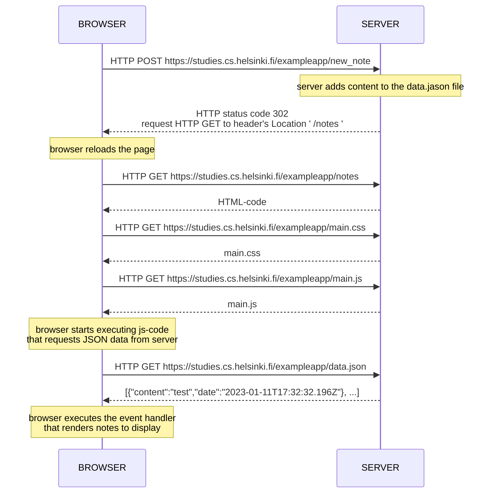

## NEW NOTE DIAGRAM


### Chain events Diagram:

 >1
 >```mermaid
 >graph TD;
 >    Browser;  
 >    to 
 >    Server;     
 >```
 >GET https://studies.cs.helsinki.fi/exampleapp/notes
 > __activate server__
 >```mermaid
 >graph TD;
 >    Server;  
 >    to   
 >   Browser;    
 >```
 >[HTML document]()
 >__deactivate server__


>2
>```mermaid
>graph TD;
>    Browser;  
>    to 
>    Server;     
>```
>GET https://studies.cs.helsinki.fi/exampleapp/main.css
>__activate server__
>  ```mermaid
>graph TD;
>    Server;  
>    to   
>    Browser;    
>```
>[the css file]()
>__deactivate server__


>3
>```mermaid
>graph TD;
>    Browser;  
>    to 
>    Server;     
>```
> GET https://studies.cs.helsinki.fi/exampleapp/main.js
> __activate server__
>   ```mermaid
>graph TD;
>    Server;  
>    to   
>    Browser;    
>```
>[the JavaScript file]()
>__deactivate server__
> > Note right of browser: The browser starts executing the JavaScript code that fetches the JSON from the server


>4
>```mermaid
>graph TD;
>    Browser;  
>    to 
>    Server;     
>```
>GET https://studies.cs.helsinki.fi/exampleapp/data.json
>__activate server__
>```mermaid
>graph TD;
>    Server;  
>    to   
>    Browser;    
>```
>[[{ "content": "HTML is easy", "date": "2023-1-1" }, ... ]]
>    __deactivate server__
> >Note right of browser: The browser executes the callback function that renders the notes


