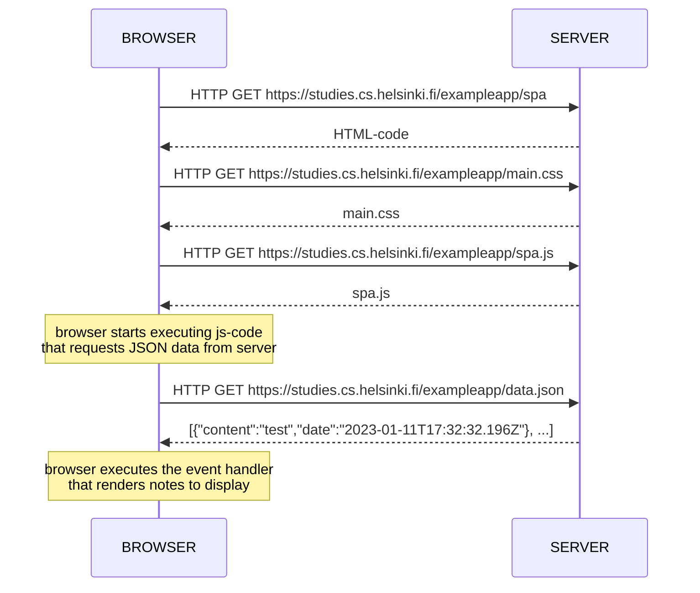

## 0.5: Single page app diagram



### Chain events Diagram:

 >1
 >```mermaid
 >graph TD;
 >    Browser;  
 >    to 
 >    Server;     
 >```
 >GET https://studies.cs.helsinki.fi/exampleapp/spa
 > __activate server__
 >```mermaid
 >graph TD;
 >    Server;  
 >    to   
 >   Browser;    
 >```
 >[HTML Code]()
 >__deactivate server__


>2
>```mermaid
>graph TD;
>    Browser;  
>    to 
>    Server;     
>```
>GET https://studies.cs.helsinki.fi/exampleapp/main.css
>__activate server__
>  ```mermaid
>graph TD;
>    Server;  
>    to   
>    Browser;    
>```
>[Main.css]()
>__deactivate server__


>3
>```mermaid
>graph TD;
>    Browser;  
>    to 
>    Server;     
>```
> GET https://studies.cs.helsinki.fi/exampleapp/spa.js
> __activate server__
>   ```mermaid
>graph TD;
>    Server;  
>    to   
>    Browser;    
>```
>[Spa.js]()
>__deactivate server__
> > Note over BROWSER: browser starts executing js-code <br> that requests JSON data from server 


>4
>```mermaid
>graph TD;
>    Browser;  
>    to 
>    Server;     
>```
>GET https://studies.cs.helsinki.fi/exampleapp/data.json
>__activate server__
>```mermaid
>graph TD;
>    Server;  
>    to   
>    Browser;    
>```
>[{"content":"test","date":"2023-01-11T17:32:32.196Z"}, ...]
>    __deactivate server__
> >note over BROWSER: browser executes the event handler <br> that renders notes to display


