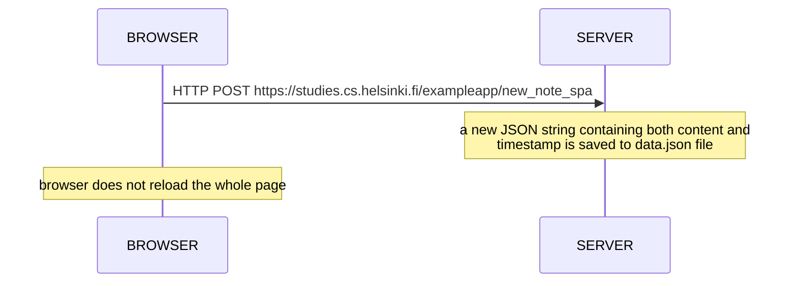

## 0.6: New note in Single page app diagram



>```mermaid
>graph TD;
>    Browser;  
>    to 
>    Server;     
>```
>GET https://studies.cs.helsinki.fi/exampleapp/new_note_spa
>__activate server__
>```mermaid
>graph TD;
>    Server;  
>    to   
>    Browser;    
>```
>    __deactivate server__
> >Note over SERVER: a new JSON string containing both content and <br> timestamp is saved to data.json file  
> > Note over BROWSER: browser does not reload the whole page